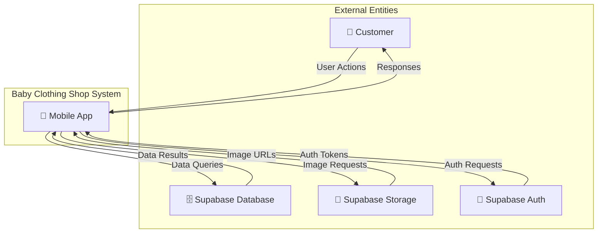
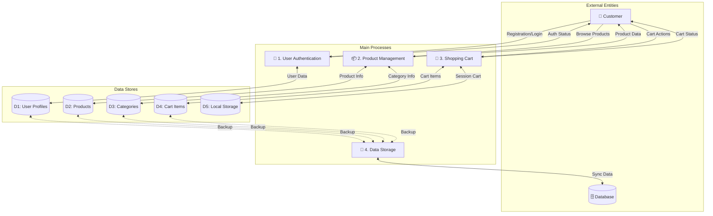
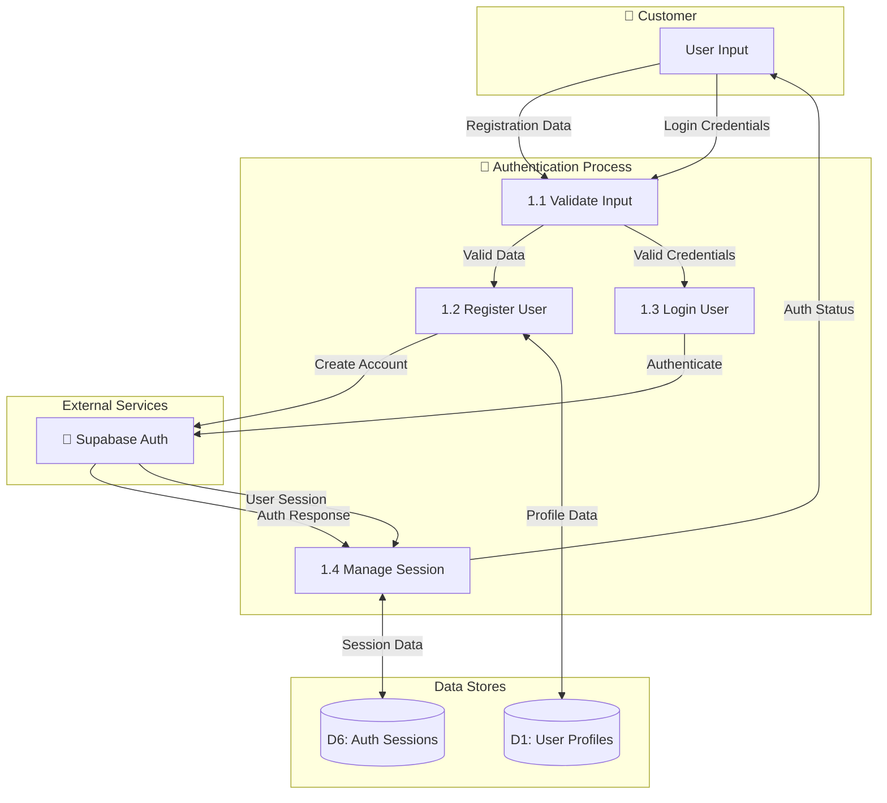
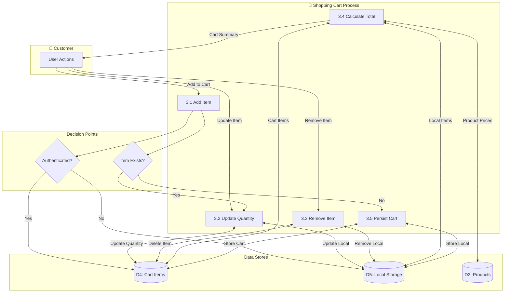
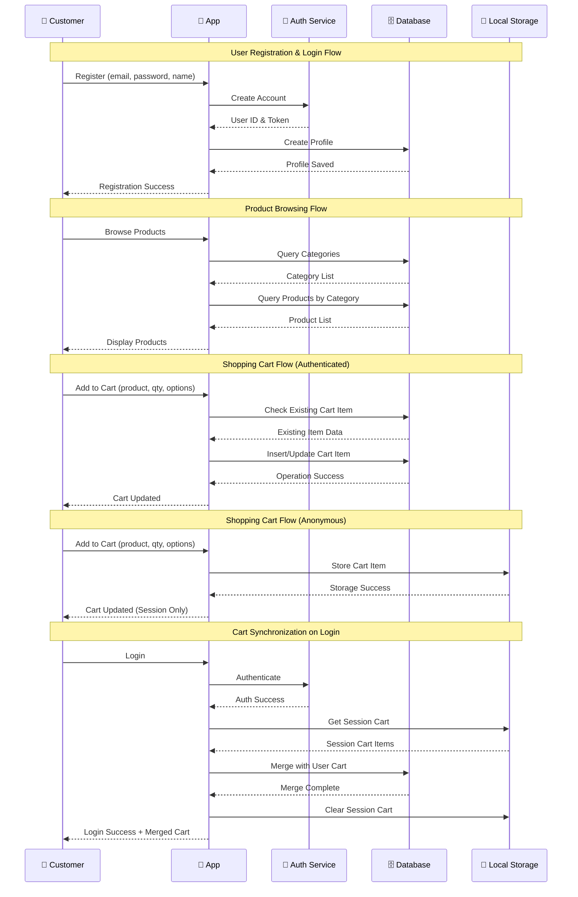
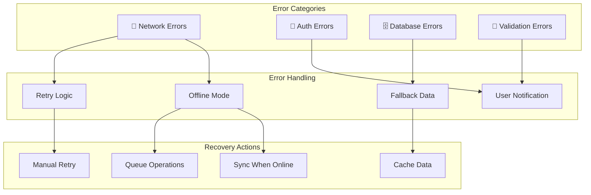

# Visual Data Flow Diagram - Baby Clothing Shop App

## Context Diagram (Level 0)

## Level 1 DFD - Main Processes

## Level 2 DFD - Authentication Process

## Level 2 DFD - Shopping Cart Process

## Data Flow Timing Diagram

## Component Interaction Matrix

| Component | User Auth | Product Mgmt | Shopping Cart | Database | Local Storage |
|-----------|-----------|--------------|---------------|----------|---------------|
| **User Auth** | - | Provides user context | User ID for cart | User profiles | Session tokens |
| **Product Mgmt** | User preferences | - | Product details | Product data | Cached products |
| **Shopping Cart** | User-specific carts | Product validation | - | Cart persistence | Anonymous carts |
| **Database** | Profile storage | Product catalog | Persistent carts | - | Sync/backup |
| **Local Storage** | Session cache | Product cache | Session cart | Offline buffer | - |

## Error Flow Diagram

This comprehensive DFD documentation provides multiple views of the data flows in your Baby Clothing Shop app, from high-level context down to detailed process flows and error handling patterns.